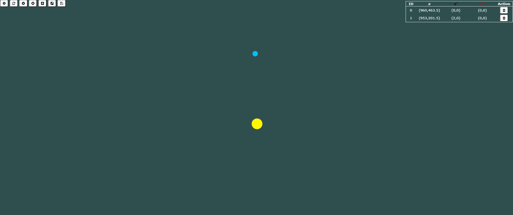
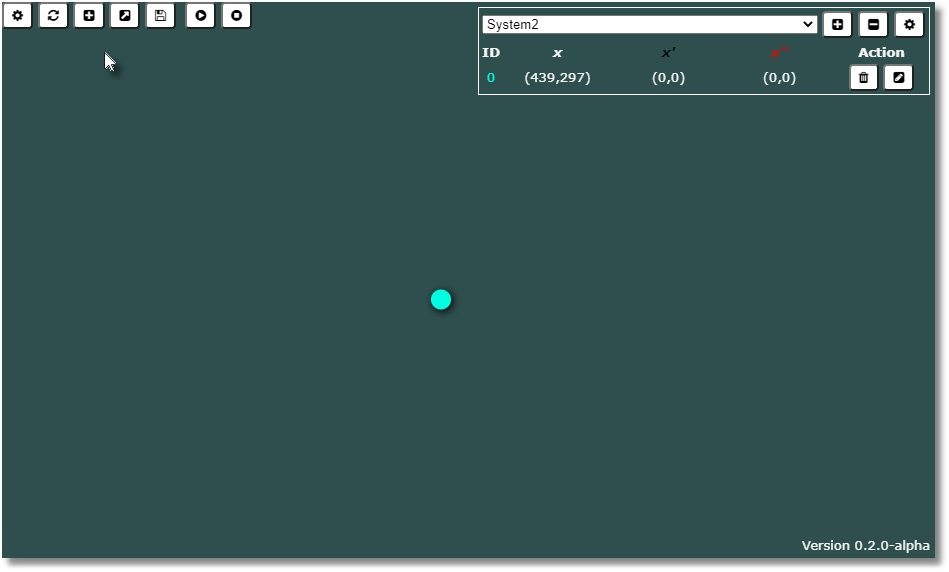
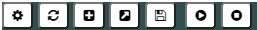
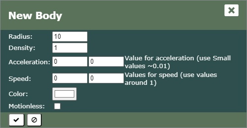
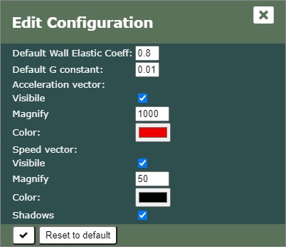
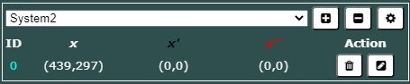
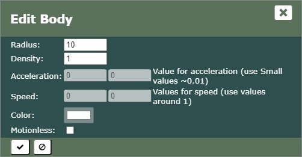
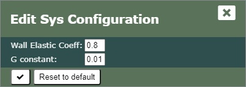

# PhysLabJs

PhysLabJS is a small HTML/CSS/JavaScript application to create one or more small systems made of spheres interacting in a 2D plane. The interaction choosen is a simularione (very simplified) of a bidimesional attractive force.

It is made for fun only, it is not intende to be used for educational purposes.

Made with [Konva.js](https://konvajs.org/).

This is an example a small system with 2 bodies:

## The Application

This is how the application is after adding some system and a body:

## The Toolbar

The toolbar contains the main set of tool to manage the systems.

The button functions are as follows:

| Button | Function |
|-|-|
| Configuration | Set the main parameters of the application |
| Refresh | Restore original position of the bodies |
| Add | Add a new body to the current system (crete a new one if none esists) |
| Load | Load the systems from the _local storage_ |
| Save | Save the systems in the _local storage_ |
| Start | Start animating the interaction |
| Stop | Stop animating the interaxtion |

### Button Add

| Field | Description |
|-|-|
|Radius|Set the radius of the spherical body. Affect appearance and mass for the gravitational interaction|
|Density|Set the density of the spherical body. Affect mass for the gravitational interaction|
|Acceleration|Set the acceleration to which the body is subjected (both axis)|
|Speed|Set the speed to which the body is _initially_ subjected (both axis)|
|Color|Set the color of the body|
|Motionless|Set whteher the body is motionless or not|

### Button Configuration

| Field | Description |
|-|-|
|Default Wall Elastic Coeff|Set the default value of the elastic coefficient of the walls, use when a new system is created|
|Default G constant|Set the default value of the constant interaction used to calculate the force, use when a new system is created|
|Acceleration vector|Acceleration vector properties group|
|Visibile|Set whether the vector is visible or not|
|Magnify|Set the magnifing factor for the vector|
|Color|Set the vector color|
|Speed vector|Speed vector properties group|
|Visibile|Set whether the vector is visible or not|
|Magnify|Set the magnifing factor for the vector|
|Color|Set the vector color|

## The System Area

### Button Edit

Only a subset of the properties is changeable at the moment.

| Field | Description |
|-|-|
|Radius|Set the radius of the spherical body. Affect appearance and mass for the gravitational interaction|
|Density|Set the density of the spherical body. Affect mass for the gravitational interaction|
|Motionless|Set whteher the body is motionless or not|

### Button System Configuration

| Field | Description |
|-|-|
|Wall Elastic Coeff|Set the default value of the elastic coefficient of the walls for the current system|
|G constant|Set the default value of the constant interaction used to calculate the force for the current system|
